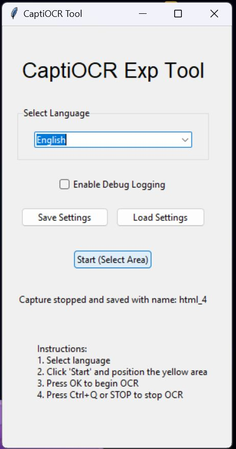
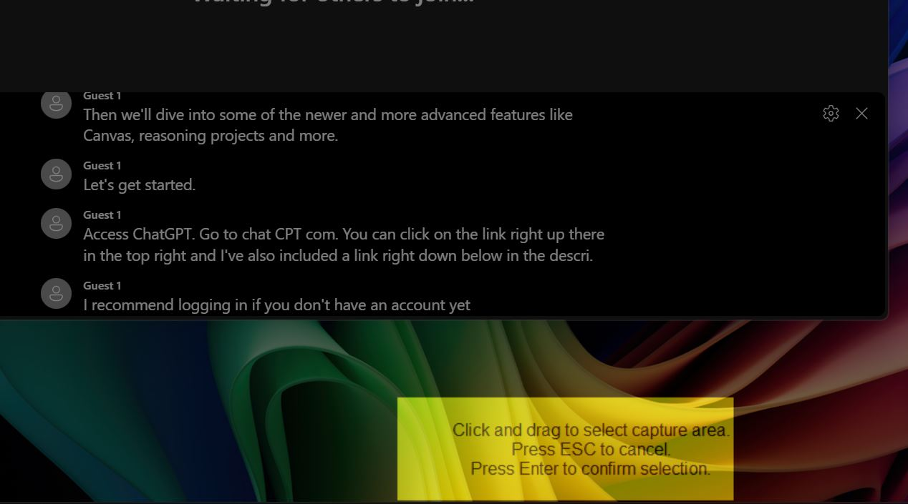
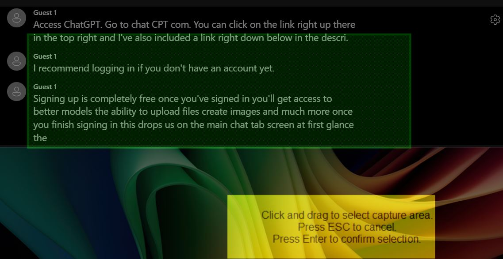
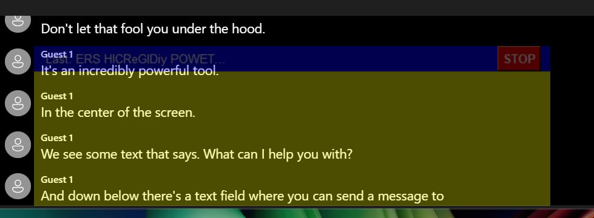
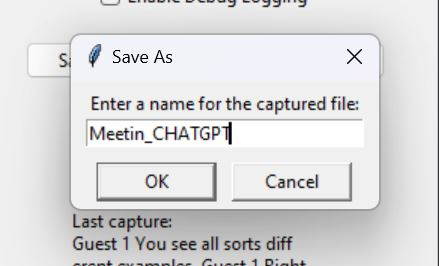
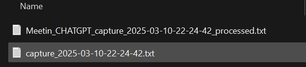
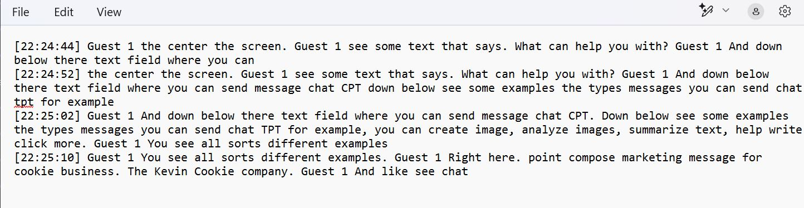

# 🖥️ CaptiOCR - Real-Time Screen Text Extraction

[](https://github.com/carlosacchi/captiocr/actions/workflows/github-code-scanning/codeql)

**CaptiOCR** is an open-source **real-time screen text extraction tool** that allows users to capture on-screen text dynamically using **Tesseract OCR**. With an easy-to-use interface, you can **select an area of the screen** and extract text **continuously**, making it ideal for live captions, subtitles, or instant text recognition.

🚀 **Planned future enhancements** include:
- ✅ **On-demand language installation** for Tesseract OCR
- ✅ **Dynamically resizable selection area** instead of a fixed rectangle
- ✅ **Improved multi-monitor support**
- ✅ **Live text and Translation overlay feature**

---

## 📌 Features
✔ **Real-time OCR processing** using [Tesseract OCR](https://github.com/tesseract-ocr/tesseract)  
✔ **Multi-language support** (English, Italian, more in the future)  
✔ **Logs and saves extracted text** to a file  
✔ **Hotkey Support:** `Ctrl+Q` to stop capture  
✔ **Named profile saving** for different capture configurations  
✔ **Optimized capture area selection** for reduced text duplication  
✔ **Debug logging** for troubleshooting  

---

## 🛠️ Prerequisites

Before installing, ensure you have the following:
- ✅ **Python 3.x** installed  
- ✅ **Tesseract OCR** installed ([Download it here](https://github.com/tesseract-ocr/tesseract))  
- ✅ **Required Python libraries**  

---

## 👥 Installation

### **1️⃣ Install Python & Dependencies**
```bash
pip install pytesseract pillow keyboard pyautogui tkinter pytesseract
```

### **2️⃣ Install Tesseract OCR**

📉 **Windows users**:  
Download & install Tesseract from [here](https://github.com/tesseract-ocr/tesseract).  
Then, update the script with the correct Tesseract path:
```python
TESSDATA_PREFIX = r'C:\Program Files\Tesseract-OCR\tessdata'
TESSERACT_CMD = r'C:\Program Files\Tesseract-OCR\tesseract.exe'
```

---

## ▶️ Running the Application

After installing the dependencies, clone the repository and run the script:
```bash
git clone https://github.com/CarloSacchi/CaptiOCR.git
cd CaptiOCR
python CaptiOCR.py
```

---

## 🖥️ How to Use

1️⃣ **Select a language** from the dropdown menu (Italian or English).
2️⃣ **Click "Start (Select Area)"** to open the selection window.



3️⃣ **Drag and Drop** over the area you want to capture.





4️⃣ **Press ENTER** to start real-time OCR.



5️⃣ **Press `Ctrl+Q`or `STOP`** to stop the capture.  

6️⃣ **Name your capture** when prompted after stopping.



**Repeat** for your next meeting.

📂 **Captured text is saved in a file named** in the "captures" folder, `capture_YYYY-MM-DD-HH-MM-SS.txt`.





---

## 🔍 Tips & Tricks

### Optimizing OCR Accuracy

- **Choose the correct language**: While OCR may sometimes work with the wrong language selected, choosing the correct language model significantly improves accuracy, especially with text containing special characters, accents, and language-specific patterns.

- **Optimize capture area**: For better results and fewer duplications, select a narrow rectangular area that focuses precisely on the caption/subtitle area. An aspect ratio that is wider than it is tall usually works best for captions.

- **Minimum area size**: Both width and height must be at least 50 pixels for OCR to function properly.

- **Saved profiles**: Save your optimized capture areas for different programs (Teams, Zoom, etc.) using the "Save Settings" feature.

### Advanced Features

- **Moving the capture area**: Click and drag the capture window to reposition it during a capture session.

- **Debug logging**: Enable the "Debug Logging" checkbox to record detailed operation information for troubleshooting.

- **Custom naming**: When stopping a capture, you can assign a custom name to the output file for better organization.

---

## 📊 Roadmap

This project is **open-source and under active development**. Upcoming improvements include:

### Architecture and Code Improvements
- 📉 **Modularized code structure** for better maintainability
- 📉 **Improved logging framework** with proper log levels
- 📉 **Better error handling and recovery**
- 📉 **Enhanced thread management** for improved stability

### UI and Usability Enhancements
- 📉 **Enhanced interface** with results panel and preview
- 📉 **Dynamic area selection** (resizable & movable during capture)
- 📉 **Dark mode and theme options**
- 📉 **Better multi-monitor support**

### Functional Enhancements
- 📉 **Expanded language options** with auto-detection capability
- 📉 **Image preprocessing options** for better OCR results
- 📉 **Multiple capture areas** simultaneously
- 📉 **Live translator** with DeepL or Google Translate API
- 📉 **Various export formats** (PDF, HTML, Word)
- 📉 **Direct clipboard integration**

### Performance Optimization
- 📉 **Optimized memory usage** during image processing
- 📉 **Parallel OCR processing** for faster results
- 📉 **Cloud integration** for storage and processing

If you want to contribute, feel free to submit **pull requests or feature requests**! 🚀

---

## 📚 License

This project is licensed under the **MIT License**, allowing free use and modification.

👤 **Author:** Carlo Sacchi