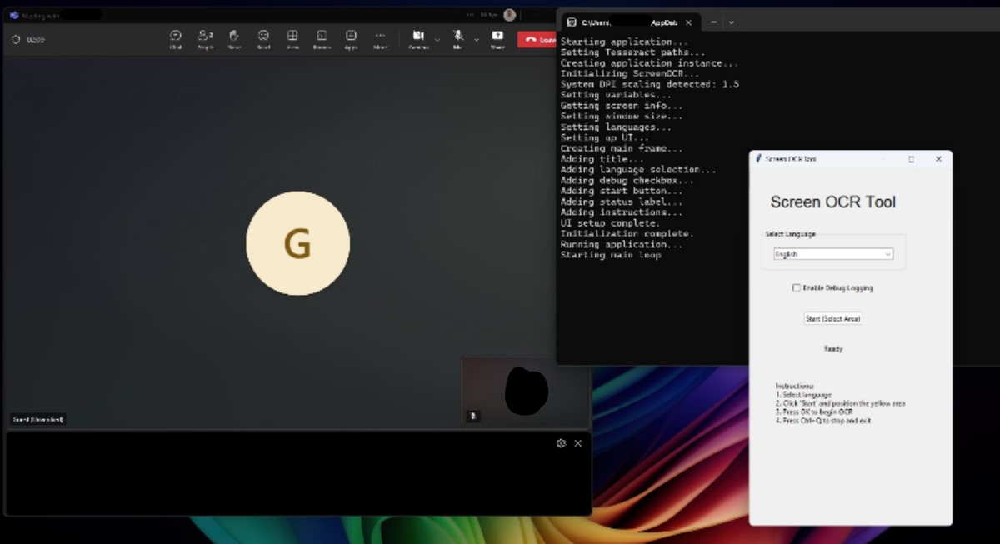
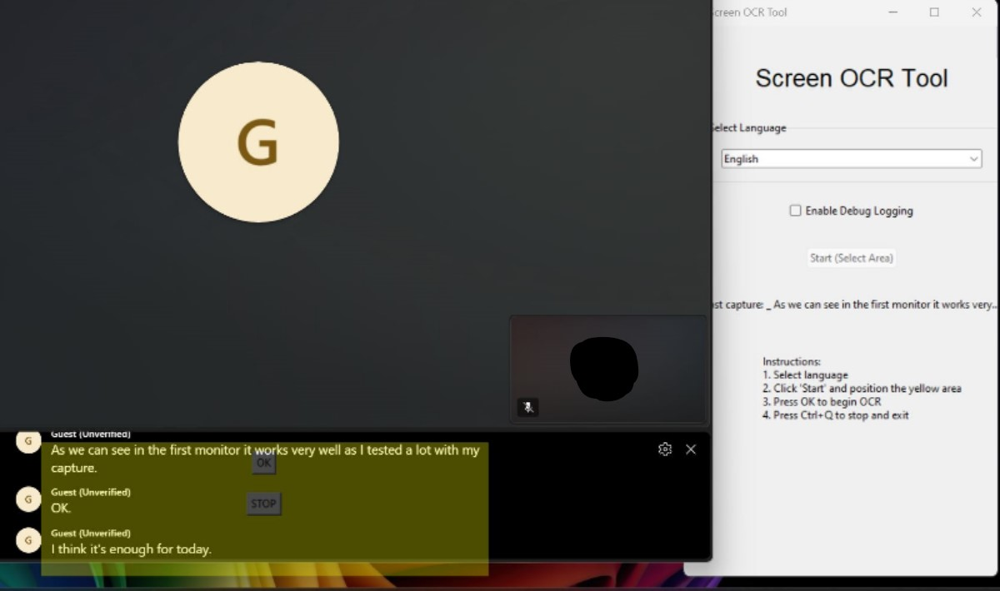
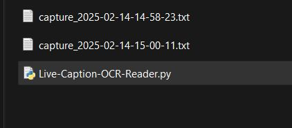
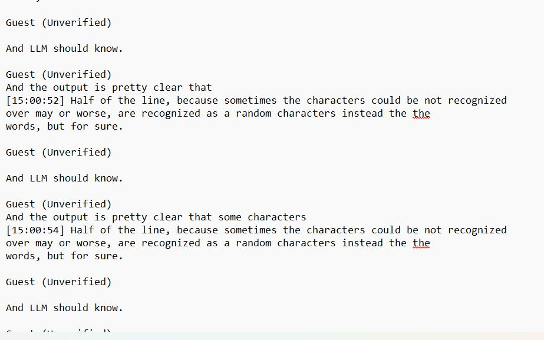

# 🖥️ CaptiOCR - Real-Time Screen Text Extraction

**CaptiOCR** is an open-source **real-time screen text extraction tool** that allows users to capture on-screen text dynamically using **Tesseract OCR**. With an easy-to-use interface, you can **select an area of the screen** and extract text **continuously**, making it ideal for live captions, subtitles, or instant text recognition.

🚀 **Planned future enhancements** include:
- ✅ **On-demand language installation** for Tesseract OCR
- ✅ **Dynamically resizable selection area** instead of a fixed rectangle
- ✅ **Improved multi-monitor support**
- ✅ **Live text and Trasnlation overlay feature**

---

## 📌 Features
✔ **Real-time OCR processing** using [Tesseract OCR](https://github.com/tesseract-ocr/tesseract)  
✔ **Multi-language support** (English, Italian, more in the future)  
✔ **Logs and saves extracted text** to a file
✔ **Hotkey Support:** `Ctrl+Q` to stop capture  

---

## 🛠️ Prerequisites

Before installing, ensure you have the following:
- ✅ **Python 3.x** installed  
- ✅ **Tesseract OCR** installed ([Download it here](https://github.com/tesseract-ocr/tesseract))  
- ✅ **Required Python libraries**  

---

## 👥 Installation

### **1️⃣ Install Python & Dependencies**
```bash
pip install pytesseract pillow keyboard pyautogui tkinter pytesseract
```

### **2️⃣ Install Tesseract OCR**

📉 **Windows users**:  
Download & install Tesseract from [here](https://github.com/tesseract-ocr/tesseract).  
Then, update the script with the correct Tesseract path:
```python
TESSDATA_PREFIX = r'C:\Program Files\Tesseract-OCR\tessdata'
TESSERACT_CMD = r'C:\Program Files\Tesseract-OCR\tesseract.exe'
```

---

## ▶️ Running the Application

After installing the dependencies, clone the repository and run the script:
```bash
git clone https://github.com/CarloSacchi/CaptiOCR.git
cd CaptiOCR
python CaptiOCR.py
```

---

## 🖥️ How to Use

1️⃣ **Select a language** from the dropdown menu (Ita or Eng).  
2️⃣ **Click "Start (Select Area)"** to open the selection window.  
3️⃣ **Drag the yellow rectangle** over the area you want to capture.  
4️⃣ **Press OK** to start real-time OCR.  
5️⃣ **Press `Ctrl+Q`or `STOP`** to stop the capture.





📂 **Captured text is saved in a file named** in the same folder as the Python file, `capture_YYYY-MM-DD-HH-MM-SS.txt`.





---

## 📊 Future Development

This project is **open-source and under active development**. Planned features include:
- 📉 **Dynamic area selection (resizable & movable)**
- 📉 **On-demand installation of additional OCR languages**
- 📉 **Better multi-monitor support**
- 📉 **Live translator with DeepL or Google Translate API**
- 📉 **I improvement**
- 📉 **Cloud integration for storage**

If you want to contribute, feel free to submit **pull requests or feature requests**! 🚀

---

## 📚 License

This project is licensed under the **MIT License**, allowing free use and modification.

👤 **Author:** Carlo Sacchi  

